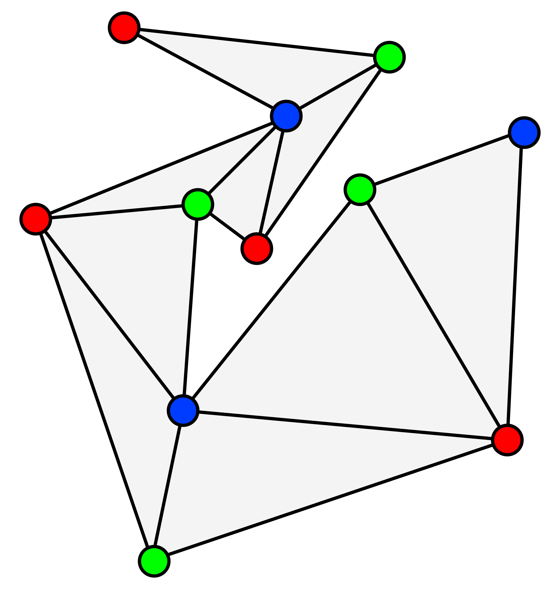
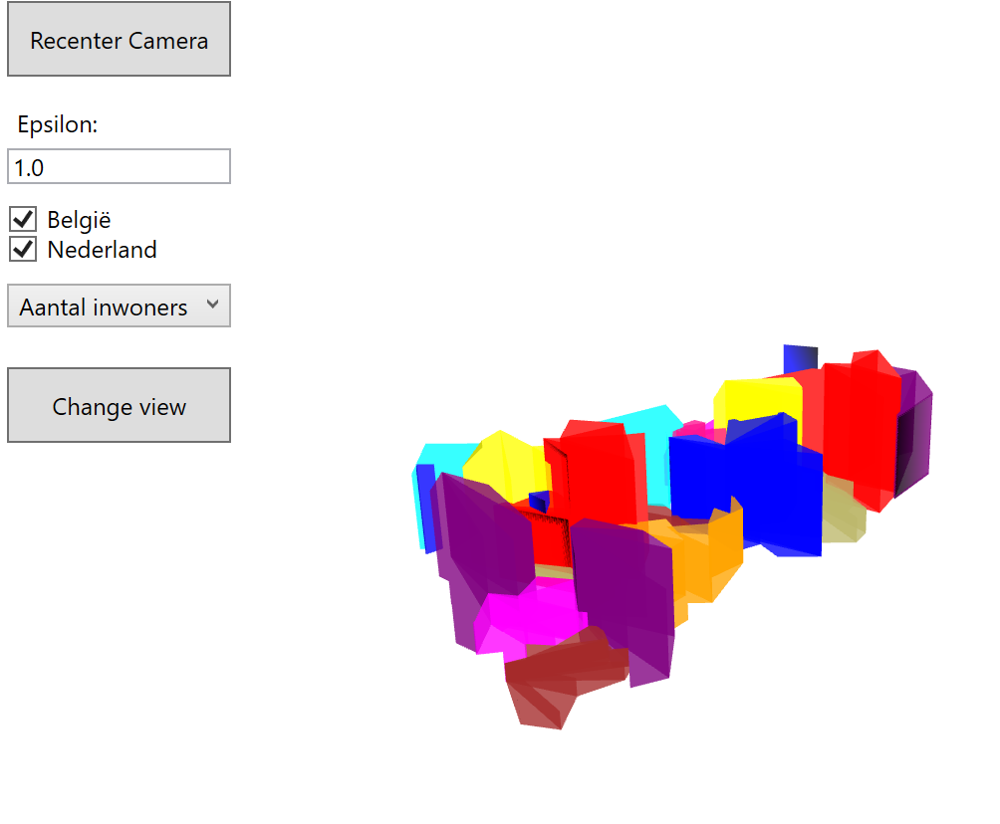

# Applied Programming Project 2 : GeoData

door Elian Van Cutsem - 2ICT2

## Inhoudstabel

1. [Onderzoek](#onderzoek)
2. [Graphical User Interface](#gui)
3. [Experimentatie](#experimentatie)
4. [Functionaliteit van de code](#functionaliteit)
5. [Besluit](#besluit)
6. [Tijdlijn](#tijdlijn)
7. [Bronnen](#bronnen)

## Onderzoek

Hieronder bevindt zich alle informatie rond mijn onderzoek voor en tijdens dit project.

### Vooronderzoek

Alvorens effectief te kunnen starten met de constructie en opbouw van het project, diende ik eerst wel het een en ander uit te zoeken. Ik begreep als snel dat ik best allereerst onderzoek zou doen naar de GeoJson.Net bibliotheek en hoe om te gaan met de data die geleverd wordt.

#### GeoJSON.Net

GeoJSON.NET is een bibliotheek die je kan toevoegen aan je project. Hiermee kan data in tekstvorm omgezet worden naar een bruikbaar object.

Tijdens het onderzoek bleek al snel dat er niet veel documentatie bestaat over deze bibliotheek. Als je echter wat beter in de [Github repository](<https://github.com/GeoJSON-Net/GeoJSON.Net>) gaat graven, vind je wel wat interessante documenten waarin bruikbare uitleg staat. Aan de hand van de .cs bestanden kan je uiteindelijk wel opmaken wat deze exact doen en betekenen. Al snel werd duidelijk dat je allereerst een "featurecollection" (een collectie van features uit het geojson bestand; bv. een lijst van provincies, steden of landen) moet initialiseren alvorens bewerkingen te kunnen maken op en met de data.

Het eerst onderzochte deel van de data zelf was een simpele uitlezing van de rechtstreekse .GeoJson bestanden op de console. Daarna was te zien hoe de data in het bestand gestructureerd is en hoe deze te interpreteren en te gebruiken is. Tenslotte wordt dan duidelijk waar de coördinaten opgeslagen zitten in het bestand en welke data nodig is om een polygoon (vorm) te tekenen op het scherm met deze data.

### Onderzoek tijdens project

#### Puntenreductie

Bij de eerste uitlezing van alle coördinaten gebruikt in de featurecollection [zie onderzoek GeoJSON.Net](# geojson.net) was duidelijk dat er enorm veel punten per feature zijn. Deze zijn enkel nodig voor enorm gedetailleerde projecties van de data. Bij een voorstelling op schaal heb je dus bijlange niet alle punten nodig. Daarom heb ik onderzoek gedaan naar een puntenreductie-algoritme.

Een puntenreductie algoritme is een algoritme dat het aantal (hoek)punten in een polygoon reduceert en zo een minder gedetailleerde versie berekent.

De werking van het algoritme dat ik uiteindelijk gebruikte is hier beschreven: [Ramer Douglas Peucker Algoritme](#puntreductie)

Zie [Bronnen](#bronnen) voor nog meer informatie.

#### Polygon triangulation

Om de polygonen in een 3D visualisatie te kunnen renderen (plaatsen in een 3D ruimte), wordt er gebruik gemaakt van triangulation. Polygonen worden onderverdeeld in driehoeken zodat deze sneller gerendered kunnen worden en eventueel een kleur en exacte locatie kunnen krijgen.

Zie [Bronnen](#bronnen) of [wikipedia](<https://en.wikipedia.org/wiki/Polygon_triangulation>) voor meer informatie.

##### Ear Clipping methode

De Ear Clipping methode is gebaseed op de __twee oren theorie__ (zie [Bronnen](#bronnen) of [Wikipedia](<https://en.wikipedia.org/wiki/Two_ears_theorem>)). Deze theorie beschrijft dat elke polygoon met meer dan 4 punten en zonder gaten, tenmniste twee 'oren' bevat. Oren zijn driehoeken waarvan 2 zijden de uiterste zijden van de polygoon zijn en de derde zich volledig binnen de polygoon bevindt. Het algoritme zoekt een oor en verwijderd dit uit de polygoon. Dit wordt herhaald todat de polygoon nog maar uit 3 punten bestaat; dit is de laatste reductie die kan worden uitgevoerd. Hierna zijn dus alle delen van de polygoon opgesplitst in driehoeken.

Het Algoritme is gemakkelijk te implementeren, maar kan traag uitvallen bij grote polygonen. Bovendien werkt het enkel bij polygonen zonder gaten.

##### Monotone polygon triangulation

Een eenvoudige veelhoek is "monotone polygoon" tenopzichte van lijn L, als een lijn loodrecht op lijn L de polygoon maximaal twee keer snijdt. Deze kan dan worden opgesplitst in twee monotone polygonen. Een polygoon die ten opzichte van de Y-as monotoon is, wordt y-monotoon genoemd.

Het algoritme begint met de polygoon van boven naar onder af te lopen terwijl diagonalen worden toegevoegd waar de polygoon monotoon is.

Dit is een snel algoritme, niet efficiënt.

##### Non-monotone polygon triangulation

Als een polygoon niet monotoon is, kan deze in monotone sub-polygonen worden verdeeld met behulp van een sweepline-benadering. Het algoritme vereist niet dat de polygoon eenvoudig is, dus het kan worden toegepast op polygonen met gaten. Over het algemeen kan dit algoritme een vlakke onderverdeling met n hoekpunten trianguleren.

#### 3D onderzoek

Nadat de polygonen succesvol kunnen worden afgeprint in een 2D ruimte, is het tijd om door te schakelen naar een 3D ruimte. Hiervoor moest niet veel onderzoek meer gebeuren aangezien we hier in het verleden ook al mee gewerkt hebben.

Om de 3D ruimte te creeëren, moet er een camera aanwezig zijn op een bepaalde positie die in een bepaalde richting kijkt. De getekende objecten moeten in het gezichtsveld van de camera liggen, anders is het niet mogelijk te zien dat deze bestaan.

Ook moeten de getekende objecten texturen (texturen / kleuren) krijgen, zodat deze effectief te zien zijn in de 3D ruimte. Er moet eveneens een lichtbron toegevoegd worden, zodat deze duidelijk zichtbaar zijn.

#### 3D Camera controller

Zoals hierboven uitgelegd, is een statische camera in een 3D ruimte niet echt interessant. Ik ben dus opzoek gegaan naar een bibliotheek die niet te moeilijk te implementeren is, en waarmee de camera bestuurd kan worden met bediening van de muis of simpele toetsenbord combinaties.
Dit is interessant wanneer de gebruiker eens wil rondkijken in de 3D ruimte, of als het getekende object te groot is voor een statische camera; in dat geval kan de gebruiker simpelweg uitzoomen.

Ik heb besloten om Helix viewport te integreren in het project, en dit omwille van de gemakkelijke integratie en importat. Ook omdat deze recht uit de doos bijna al het nodige bevat om de camera te controleren zoals ik dat in gedachten had.

## GUI

Hieronder bevindt zich een gids over wat je kan doen met de User Interface en hoe deze te gebruiken.

### Knoppen

In de GUI (graphical user interface of gebruikersinterface) zijn enkele knoppen voorzien om het gebruik van het programma makkelijker of uitgebreider te maken. Er zijn 5 opties aanwezig in het programma:

- Recenter camera : Deze knop brengt de camera weer naar zijn originele positie (dezelfde als bij het starten van het programma)
- selectievakjes met landen : Elk land waar een vinkje naast staat zal bij de volgende fase van het programma geladen worden.
- een dropdown list (selecteerlijst) met opties voor data : je selectie zorgt voor de hoogte die zal gegenereerd worden per land en per provincie.
- een change view knop : Deze knop brengt het scherm weer naar zijn originele positie en laadt alle veranderde nieuwe opties in.
- camera view knop: Bij een klik op deze knop zal de camera naar de dichtsbijzijnde loodrechte positie gebracht worden.

### Muis

In de GUI kan de muis gebruikt worden om de knoppen aan te klikken, maar ook om de camera te controleren:

- linkermuisknop : deze wordt enkel gebruikt om knoppen aan te kunnen klikken.
- rechtermuisknop: dit draait het gehele 3D paneel rond de horizontale as.
- scrollen : hiermee zoomt de camera in of uit.

### Toetsenbord

Er zijn ook enkele functies voorzien op het toetsenbord om de camera te controleren:

- z : dit verplaatst de camera één tick naar onder
- q : dit verplaatst de camera één tick naar boven
- a : dit verplaatst de camera één tick naar links
- d : dit verplaatst de camera één tick naar rechts
- s : dit zoomt de camera één tick uit
- w : dit zoomt de camera één tick in
- pijtjes : deze controleren de gehele 3D ruimte, bij het pijltje naar links bv. draait het 3D paneel naar links rond zijn as

## Experimentatie

Hieronder een verslag van experimentatie met het project

### GeoJson

#### Meerdere GeoJson files

Tijdens de 2D fase van het project
Het Project is licht aangepast om ook meerdere GeoData files te kunnen accepteren. Alle namen van files kunnen meegegeven worden in de __DataToUse.cs__ klasse die ervoor zorgt dat het niet te ingewikkeld is om settings aan te passen. De polygonen en bewerkingen worden uitgevoerd in de ingegeven volgorde. Om deze allemaal mooi te laten passen aan elkaar en juiste verhoudingen te geven, worden eerst de globale maximale en minimale coordinaten gezocht. Op die manier past alles mooi op je scherm.

Op de afbeeldingen hieronder kan je zien dat eerst enkel Duitsland te zien is, op de 2de afbeelding zie je België, Duitsland en Oostenrijk in relatie tot elkaar.

#### Experimentatie met verschillende Epsilon

Tijdens de 3D fase ben ik een beetje beginnen spelen met de epsilon, dat is de graad waarmee het [puntreductie-algoritme](#puntreductie) wordt uitgevoerd.

Het is duidelijk dat op de eerste afbeelding veel minder detail te zien is dan op de 2de afbeelding

#### Experimentatie met GUI

Tijdens de bouw van het project is er telkens ook geëxperimenteerd met verschillende GUI functies. Tijdens de 2D fases werden er knoppen toegevoegd om in en uit te zoomen. Tijdens de 3D fase was dit natuurlijk niet meer nodig, gezien de dynamisch beweegbare camera. Er zijn wel enkele knoppen toegevoegd in de GUI om experimentatie mogelijk en makkelijker te maken. Zo is er een knop voorzien om de camera terug op zijn beginpositie te plaatsen. Er is een invulveld voorzien om de epsilon aan te passen. Er worden een dropdown en selectievakjes weergeven om verschillende geodata en data te combineren zonder het programma heroptestarten of te zoeken in de code. Tijden de 2D fase van dit project had ik hier ook al aan gedacht, maar omwille van de veel simpelere functies van 2D canvassen, was dit niet mogelijk. Dus zat er een klasse __DataToUse.cs__ in alle data verzamelde zodat de gebruiker gemakkelijk lijsten en data kon aanpassen en heropstarten.

#### Experimentatie met Geodata en data

Tijdens de 3D fase is er enorm veel gespeeld en gezocht naar goede data om te gebruiken om polygonen in de hoogte te tekenen. Omdat ik meerdere geodata bestanden wou gebruiken in mijn project moest het data zijn die gemakkelijk in meerdere bestanden / landen te vinden is. Hiervoor heb ik gebruik gemaakt van een dropdown op de GUI, omdat de data dan gemakkelijker te verwerken was. Ik vond het ook een leuk idee om meerdere geojson bestanden tegelijkertijd te kunnen laden met dezelfde data zodat je data kan vergelijken. Dit is te zien op onderstaande foto's.

#### Experimentatie met 3D camera controller

Tijdens onderzoek naar een goede 3D camera controller stootte ik op de Helix viewport bibliotheek. Net zoals andere bibliotheken was deze heel gemakkelijk te implementeren via de NuGet package manager (het standaard importeer gereedschap voor visual Studio / Programma waarmee gewerkt wordt). Helix viewport zorgt in het bijzonder voor een heel gemakkelijke integratie van controle voor camera's in 3D. Er zijn standaard toetsencombinaties voorzien voor het in- en uitzoomen, roteren en verplaatsen van de camera.

Het valt wel heel hard op dat hoe meer polygonen gebruikt worden, hoe minder vlot de camera reageert.

## Functionaliteit

Hieronder een uitleg over hoe de code in zijn werk gaat.

### Start van het programma

Tijdens de start van het programma wordt er automatisch de geodata en data van België ingeladen. Deze verschijnt echter niet op het scherm zolang je niet op de knop op de GUI klikt. Als je een andere optiekeuze maakt, wordt de gekozen data ingeladen, deze data wordt verwerkt tot FeatureCollections.
Nadat de data is verwerkt naar collections, wordt een algemeen laagste x en y coordinaat bepaald. Daarvoor gaat de methode __GetMaxMinValues()__ in de klasse __MainWindow.xaml.cs__ alle FeatureCollections coordinaten af, en zoekt naar de laagste x en y waarden. Deze worden later gebruikt om de tekening volledig correct in proportie tot elkaar en in het venster te weergeven.

Als de X en Y berekend zijn, gaat het programma de coördinaten verwerken en aanpassen met [GPS Projectie](#GPSProjectie). Het programma maakt per feature een puntenlijst en past elke individuele coordinaat aan. Nadat deze lijst geheel verwerkt is, gaat deze door het [Ramer Douglas Peucker algoritme](#Puntreductie). Als dit gebeurd is, worden de polygonen gesplitst in verschillende driehoeken; daarvoor wordt het cutting ears algoritme gebruikt. (zie [bronnen](#bronnen) voor meer informatie). Nu worden alle driehoeken getekend en krijgen deze allemaal dezelfde kleur per feature.

### GeoJson Data

Zie [Bronnen](#bronnen) voor meer informatie over Auteur en implementatie

De GeoJson data wordt verwerkt via de [GeoJson.Net](#geojson.net) bibliotheek. Hiervoor wordt de klasse __GetData.cs__ gebruikt. In deze klasse wordt de .geojson file ingelezen als String, deze wordt dan verwerkt naar een featurecollection door de klasse.

### Puntreductie

#### Ramer Douglas Peucker

Zie [Bronnen](#bronnen) voor meer informatie over auteur en implementatie

Deze gebruikt __PointReduction.cs__. Het doel van dit algoritme is, gegeven een curve die bestaat uit lijnsegmenten (die in sommige contexten ook een polylijn wordt genoemd), om een vergelijkbare curve met minder punten te vinden. Het algoritme definieert 'ongelijk' op basis van de maximale afstand tussen de oorspronkelijke curve en de vereenvoudigde curve (d.w.z. de Hausdorff-afstand tussen de curves). De vereenvoudigde curve bestaat uit een subset van de punten die de oorspronkelijke curve hebben gedefinieerd.

### GPSProjectie

De gps projectie die in dit project gebruikt wordt, is de Mercatorprojectie. Deze staat vast volgens de formule :

via [Mercator Projection Wikipedia](#<https://en.wikipedia.org/wiki/Web_Mercator_projection>), voor meer info zie [Bronnen](#Bronnen)

GPS Projectie wordt gebruikt om vervorming van het aardoppervlak tegen te gaan.

### Triangulation

Triangulation is een principe waarbij je alle punten in een polygoon in driehoeken verdeeld. Hiervoor bestaan verschillende methodes. In dit project wordt het principe van de cutting ears gebruikt. De source van het algoritme is afkomstig van [Rod Stephen, CsharpHelper](#<http://csharphelper.com/blog/2014/07/triangulate-a-polygon-in-c/>). Zie bronnen voor meer info.

### 3D

Om alles om te zetten van 2D naar 3D heb ik eigenlijk niet veel hoeven te veranderen. Er werd een 3D viewport toegevoegd aan het project waarin ik allereerst het DemoProject 3D ingeladen heb. Daarna heb ik dat gebruikt om de kubus om te vormen tot een driehoek. Eens dat gelukt was, moest ik enkel mijn eigen coördinaten meegeven aan de prisma om deze op de juiste locatie te zetten. De hoogte wordt gezocht op basis van een array waarin alle gegevens zitten.

### cameracontroller

De gebruikte cameracontroller is die van de helix viewport toolkit. Daarvoor moest ik mijn 'normale' WPF 3D viewport omvormen naar een helix viewport en deze een naam geven, zodat ik mijn polygonen naar deze viewport kan schrijven i.p.v. de 3D viewport

## Besluit

### Hoe heb ik het aangepakt

Ik ben allereerst begonnen met verschillende geodata bestanden te downloaden en te onderzoeken wat hierin staat en hoe deze te gebruiken is. Eens ik dat verstond, heb ik onderzoek gedaan naar hoe ik deze data effectief kon omzetten naar een 2D polygoon. Tijdens de 2D fase, heb ik ook direct Point reduction en polygon triangulation toegepast, zo kon ik mooi zien dat alles exact werkte alvorens in 3D te starten. Toen in 2D alles leek te werken zoals verwacht, ben ik begonnen in 3D. Eerst wat rondgezocht hoe ik data kon tekenen en verwerken tot een 3D model. Daarna was het maar data ingeven en opvullen van de 3D ruimte

### Wat vond ik ervan

Ik vond het een zeer leuk en interessant project om aan te werken. In het begin leek de einddoestelling zo onmogelijk haalbaar, maar doorheen het project, ontdekte ik hoe ik steeds dichter en dichter tegen de doelstelling kwam.
Het was tevens ook een interessant project. Ik heb veel bijgeleerd over zowel polygonen als over 3D objecten en ruimtes.

### Wat heb ik bijgeleerd

Ik heb vooral veel bijgeleerd over 3D. Het hoeft niet persé heel ingewikkeld te zijn om iets degelijk op het scherm te kunnen zetten. Ook was het best wel cool om te kunnen zien hoe de algoritmes in hun werking gaan.

### Toekomst

Ik heb het project eigenlijk wat te lang uitgesteld Ik ben pas op oudejaar begonnen, daardoor heb ik wel een aantal dagen heel hard doorgewerkt, maar om ook te kunnen genieten tijdens het programmeren, zou ik het liever uitgespreid hebben over een langere periode. Ik plan dit dan ook te proberen bij toekomstige projecten. Ik ben ook wel blij dat ik mijn hoofd niet heb laten hangen tijdens moeilijk momenten waarbij ik soms uren vastzat op een simpel probleem en het niet kon oplossen met een simpele debug. Soms moest ik wel wat externe hulp inroepen, maar het is al bij al toch maar gelukt.

## Tijdlijn

Hieronder een tijdlijn van het project.

### 31/12/2019

- Start van [Onderzoek](#onderzoek)

### 01/01/2020

- Start met gebruiken en onderzoeken van [GeoJson](#geojson.net) data, start met simpele 2D polygonen.
- Puntreductie toegepast zie [Ramer Douglas Peucker Algoritme](#puntreductie)

### 02/01/2020

- Problemen met 2D polygonen tekenen oplossen.
- Experimentatie met meerdere [GeoJson](#geojson) datafiles

### 03/01/2020

- Afwerken 2D polygonen.
- Kleuren toevoegen per Feature
- meerdere [GeoJson](#geojson) datafiles optimaliseren
- Basis verslag geschreven
- Basis Triangulation

### 04/01/2020

- afwerken Triangulation
- start 3D
- verslag aanvullen

### 05/01/2020

- verder werken aan 3D

### 06/01/2020

- afwerken basis 3D
- Data toevoegen om hoogte te bepalen in 3D
- 3D camera controle libraries
- verder bewerken van verslag

### 07/01/2020

- afwerken verslag

## Bronnen

De gebruikte bronnen tijdens onderzoek, experimentatie en constructie van het project

1. [Wambachers-OSM](<https://wambachers-osm.website/>) (z.d.). Geraadpleegd op 30/12/2019 van [Wambachers-OSM boundaries Map](<https://wambachers-osm.website/boundaries/>)
2. [GeoJSON-Net](<https://github.com/GeoJSON-Net>), [Github](<https://github.com/>)(02/12/2019). Geraadpleegd op 30/12/2019 van [GeoJSON.Net](<https://github.com/GeoJSON-Net/GeoJSON.Net>)
3. [Wikipedia](<https://nl.wikipedia.org>) (z.d.). Geraadpleegd op 30/12/2019 van [Polygon Triangulation](<https://en.wikipedia.org/wiki/Polygon_triangulation>)
4. [Wikipedia](<https://nl.wikipedia.org>) (z.d.). Geraadpleegd op 30/12/2019 van [Two Ears Theorem](<https://en.wikipedia.org/wiki/Two_ears_theorem>)
5. [Wikipedia](<https://nl.wikipedia.org>) (z.d.).  Geraadpleegd op 30/12/2019 van [Monotone Polygon](<https://en.wikipedia.org/wiki/Monotone_polygon>)
6. [Toby S.](<https://codereview.stackexchange.com/users/75307/toby-speight>) & [D4l3kS](<https://codereview.stackexchange.com/users/27710/d4l3k>), [StackExchange](https://codereview.stackexchange.com) (25/07/2013). Geraadpleegd op 31/12/2019 van [Ramer Douglas Peucker algorithm](<https://codereview.stackexchange.com/questions/29002/ramer-douglas-peucker-algorithm>)
7. [Craig S.](<https://www.codeproject.com/script/Membership/View.aspx?mid=162296>), [Codeproject](<https://www.codeproject.com/>) (06/06/2007). Geraadpleegd op 31/12/2019 van [Implementation of Douglas Peucker](<https://www.codeproject.com/articles/18936/a-c-implementation-of-douglas-peucker-line-appro>)
8. [Tomvdcs](<https://stackoverflow.com/users/12618479/tomvdcs>), [StackOverflow](<https://stackoverflow.com>) (29/12/2019). Geraadpleegd op 31/12/2019 van [How to draw polygons and connect them](<https://stackoverflow.com/questions/59518718/how-to-draw-multiple-polygons-and-connect-them>)
9. [drunkmonkey](<https://stackoverflow.com/users/312928/drunkmonkey>), [StackOverflow](<https://stackoverflow.com>) (15/01/2013), Geraadpleegd op 01/01/2020 van [convert latitude and longitude to mercator projection](<https://stackoverflow.com/questions/14329691/convert-latitude-longitude-point-to-a-pixels-x-y-on-mercator-projection>)
10. [Nick G.](<https://github.com/nickgravelyn>), [Github](<https://github.com/>) (25/07/2017). Geraadpleegd op 02/01/2020 van [Triangulator by Nick Gravelyn](<https://github.com/nickgravelyn/Triangulator>)
11. [Auteursrechten.nl](<https://www.auteursrechten.nl>) (z.d.). Geraadpleegd op 03/01/2020 van [APA richtlijnen](<https://www.auteursrechten.nl/files/auteursrechten/2019-09/surf_de-apa-richtlijnen-uitgelegd_versie-november-2018.pdf>)
12. [Wikipedia](<https://nl.wikipedia.org>) (z.d.). Geraadpleegd op 03/01/2020 van [Mercator Projection](<https://en.wikipedia.org/wiki/Web_Mercator_projection>)
13. [Hotoo](<https://github.com/hotoo/>), [Github](<https://github.com/>) (19/12/2017), Geraadpleegd op 03/01/2020 van [MarkLine Github repository](<https://github.com/hotoo/markline>)
14. [fgshen](<https://www.codeproject.com/script/Membership/View.aspx?mid=1327046>), [Codeproject](<https://www.codeproject.com/>) (4/10/2004). Geraadpleegd op 03/01/2020 van [Polygon Triangulation in C#](<https://www.codeproject.com/articles/8238/polygon-triangulation-in-c>)
15. David E. (18/10/2002). [Triangulation by Ear Clipping](<https://www.geometrictools.com/Documentation/TriangulationByEarClipping.pdf>) Geraadpleegd op 03/01/2020 van [Geometric tools](<https://www.geometrictools.com/Documentation/TriangulationByEarClipping.pdf>)
16. [Kvanttt](<https://pastebin.com/u/KvanTTT>), [Pastebin](<https://pastebin.com/>) (08/10/2012). Geraadpleegd op 03/01/2020 van [Polygon Triangulation](<https://pastebin.com/SM958uN3>)
17. [Daniel C.](<https://www.codeproject.com/script/Membership/View.aspx?mid=6687413>), [Codeproject](<https://www.codeproject.com/>) (22/11/2009), Geraadpleegd op 03/01/2020 van [Triangulation of Arbitrary Polygons](<https://www.codeproject.com/articles/44370/triangulation-of-arbitrary-polygons>)
18. [Wikipedia](<https://nl.wikipedia.org>) (z.d.), Geraadpleegd op 03/01/2020 van [Delaunay triangulation](<https://en.wikipedia.org/wiki/Delaunay_triangulation>)
19. Rod S. (29/07/2014). Geraadpleegd op 04/01/2020 van [Triangulate a Polygon in c#](#<http://csharphelper.com/blog/2014/07/triangulate-a-polygon-in-c/>)
20. DotNET Development, [youtube](<https://www.youtube.com/>) (19/07/2018). Geraadpleegd op 06/01/2020 van [WPF Tutorial introduction in 3D](<https://youtu.be/09Fv5cNdbnA>)
21. [Volksgezondheidenzorg](<https://www.volksgezondheidenzorg.info>) (2019). Geraadpleegd op 6/01/2020 van [Gezondheidenzorg.info / Alcoholgebruik](<https://www.volksgezondheidenzorg.info/onderwerp/alcoholgebruik/regionaal-internationaal/regionaal#node-overmatige-drinkers-ggd-regio>)
22. [Metatopos.eu](<https://www.metatopos.eu>) (04/01/2020). Geraadpleegd op 06/01/2020 van [Metatopos](<https://www.metatopos.eu/provincies_eu.php>)
23. [Helix Toolkit](<https://github.com/helix-toolkit>), [Github](<https://github.com/>) (22/02/2018). Geraadpleegd op 06/01/2020 van [Helix-Toolkit](<https://github.com/helix-toolkit/helix-toolkit/wiki/Getting-started-with-WPF-3D>)
24. [Tiago R.](<https://stackoverflow.com/users/643874/tiago-ribeiro>), [StackOverflow](<https://stackoverflow.com>) (04/03/2011). Geraadpleegd op 06/01/2020 van [anchor controls in wpf](<https://stackoverflow.com/questions/5188586/how-to-anchor-controls-in-wpf#5188623>)
25. [WPFTutorial](<https://www.wpf-tutorial.com>) (z.d.). Geraadpleegd op 06/01/2020 van [The full combobox tutorial](<https://www.wpf-tutorial.com/list-controls/combobox-control/>)
26. [WPFTutorial](<https://www.wpf-tutorial.com>) (z.d.). Geraadpleegd op 06/01/2020 van [The full checkbox tutorial](<https://wpf-tutorial.com/basic-controls/the-checkbox-control/>)
27. [Wikipedia](<https://nl.wikipedia.org>) (z.d.). Geraadpleegd op 06/01/2020 [Provincies van België](<https://nl.wikipedia.org/wiki/Provincies_van_Belgi%C3%AB>)
28. [Belgische Overheid](<https://www.belgium.be>) (z.d). Geraadpleegd op 06/01/2020 van [Gemeenten in België](<https://www.belgium.be/nl/over_belgie/overheid/gemeenten>)
